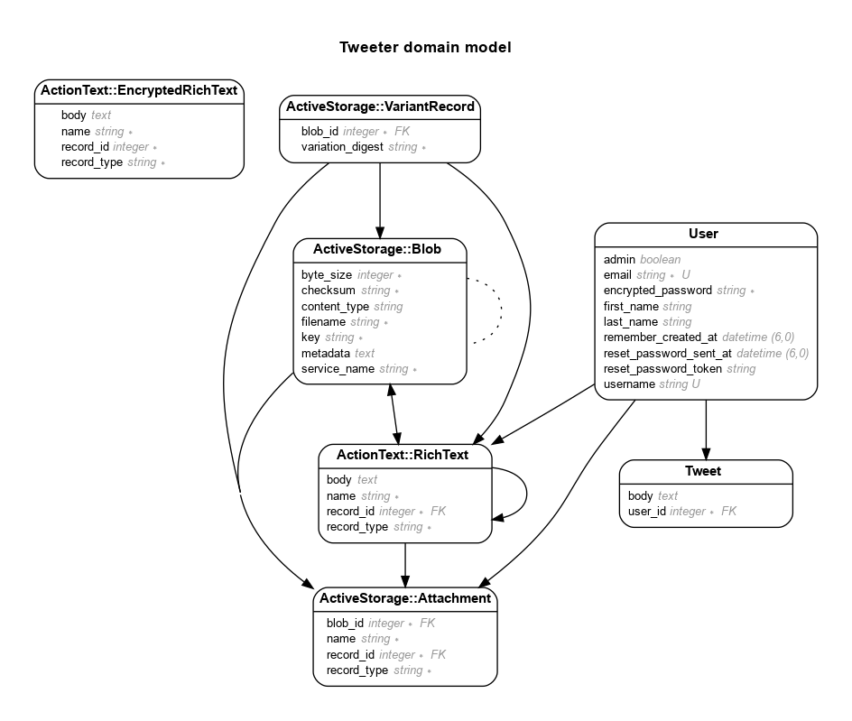

# README

Twitter clone on Rails 7

Following Youtube Guide: https://www.youtube.com/watch?v=loYfUpwoLlM

Using Template: Kickoff Tailwind - https://github.com/justalever/kickoff_tailwind

Live - TODO: https://tweeter.dipenchauhan.com

# Model

Generated by Rails ERD. Run rails erd to regenerate (must have graphviz).

# Versions

- ruby 3.2.2 (2023-03-30 revision e51014f9c0) [x86_64-linux]
- Rails 7.0.8

* System dependencies

# Configuration

If bin/dev does not work, try running:
`$ gem install foreman`

- Database creation

- Database initialization

- How to run the test suite

- Services (job queues, cache servers, search engines, etc.)

- Deployment instructions

- ...

# References

- Rubocop: https://github.com/colinsoleim/react-on-rails-template/blob/main/.rubocop.yml
